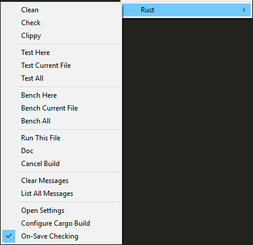

# Rust Context Menu

You can access Sublime's context menu with a right click.

## Cargo Commands
A variety of Cargo commands are available here for quick access so you don't
have to frequently switch your build system variant.  Some of them are
context-sensitive, based on where you click the mouse.

* **Clean**: `cargo clean` to remove build artifacts.
* **Check**: `cargo check` to quickly check your package for errors.
* **Clippy**: `cargo clippy` to run
  [Clippy](https://github.com/rust-lang-nursery/rust-clippy) on your source.
---
* **Test Here**: Runs just the one test underneath the cursor.  A similar
  command is also available in the Sublime Command Palette as "Rust: Run Test
  At Cursor".
* **Test Current File**: Runs all tests in the current file.
* **Test All**: Runs all tests in the package.
---
* **Bench Here**: Runs just the one benchmark underneath the cursor.
* **Bench Current File**: Runs all benchmarks in the current file.
* **Bench All**: Runs all benchmarks in the package.
---
* **Run This File**: `cargo run` the current file.
* **Doc**: `cargo doc` to generate documentation.
* **Cancel Build**: Cancel the current build.  Also available with keyboard
  shortcuts, see [build docs](build.md).

## Message Commands
* **Clear Messages**: Remove inline error/warning messages.  Also available
  with the Esc key, or click the &#xd7; symbol in the message.
* **List All Messages**: Show a quick panel popup with a list of all current
  messages.

## Settings Commands
* **Open Settings**: Open the Rust Enhanced settings.
* **Configure Cargo Build**: Run the command to interactively configure Cargo
  build settings stored in your Sublime project file.  See
  [Configure Command](build.md#configure-command).
* **On-Save Checking**: Toggle `cargo check` running every time you save a
  Rust file.
