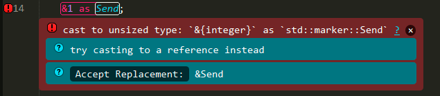
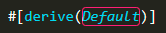
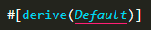
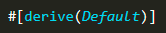

# Diagnostic Messages

There are a variety of ways to display Rust compiler messages.
See [Settings](../settings.md) for more details about how to configure settings.

## Inline Phantoms vs Output Panel

The `show_errors_inline` setting controls whether or not errors are shown inline with the code using Sublime's "phantoms".
If it is `true`, it will also display an abbreviated message in the output panel.
If it is `false`, messages will only be displayed in the output panel, using rustc's formatting.

### `show_errors_inline`

| Value | Example |
| ----- | ------- |
| `true` |  |
| `false` | 

## Popup Phantom Style

Phantoms can be displayed inline with the code, or as a popup when the mouse hovers over an error (either the gutter icon or the error outline).
The `rust_phantom_style` setting controls this behavior.

### `rust_phantom_style`

| Value | Description |
| :---- | :---------- |
| `normal` | Phantoms are displayed inline. |
| `popup` | Phantoms are displayed when the mouse hovers over an error. |
| `none` | Phantoms are not displayed. |


### Popup Command
You can bind the `rust_message_popup` command to a keyboard shortcut to force a popup to open if there is a message under the cursor.
Example:

```json
{"keys": ["f8"], "command": "rust_message_popup", "context":
    [
        {"key": "selector", "operator":"equal", "operand": "source.rust"}
    ]
}
```

## Phantom Themes

The style of the phantom messages is controlled with the `rust_message_theme` setting.
Currently the following themes are available:

### `rust_message_theme`

| Value | Example |
| ----- | ------- |
| `clear` |  |
| `solid` |  |

### Clear Theme Colors

The `clear` theme is designed to integrate with your chosen Color Scheme.
You can customize the colors of the messages with the following settings.

| Setting | Default | Description |
| :------ | :------ | :---------- |
| `rust_syntax_error_color` | `"var(--redish)"` | Color of error messages. |
| `rust_syntax_warning_color` | `"var(--yellowish)"` | Color of warning messages. |
| `rust_syntax_note_color` | `"var(--greenish)"` | Color of note messages. |
| `rust_syntax_help_color` | `"var(--bluish)"` | Color of help messages. |


## Region Highlighting

The span of code for a compiler message is by default highlighted with an outline.

### `rust_region_style`

| Value | Example | Description |
| :---- | :------ | :---------- |
| `outline` |  | Regions are highlighted with an outline. |
| `solid_underline` |  | Solid underline. |
| `stippled_underline` |  | Stippled underline. |
| `squiggly_underline` |  | Squiggly underline. |
| `none` |  | Regions are not highlighted. |

## Gutter Images

The gutter (beside the line numbers) will include an icon indicating the level of the message.
The styling of these icons is controlled with `rust_gutter_style`.

### `rust_gutter_style`

| Value | Description |
| :---- | :---------- |
| `shape` |  |
| `circle` |  |
| `none` | Do not display icons. |

## Other Settings

A few other settings are available for controlling messages:

| Setting | Default | Description |
| :------ | :------ | :---------- |
| `show_panel_on_build` | `true` | If true, an output panel is displayed at the bottom of the window showing the compiler output. |
| `rust_syntax_hide_warnings` | `false` | If true, will not display warning messages. |
| `rust_message_status_bar` | `false` | If true, will display the message under the cursor in the window status bar. |
| `rust_message_status_bar_msg` | `"Rust check running` | The message to display when the syntax check is running.
| `rust_message_status_bar_chars` | `[".", "..", "...", ".."]` | The characters shown in the status bar while a check is running.
| `rust_message_status_bar_update_delay` | 200 | How often (ms) should the status bar text be updated when syntax checking.
